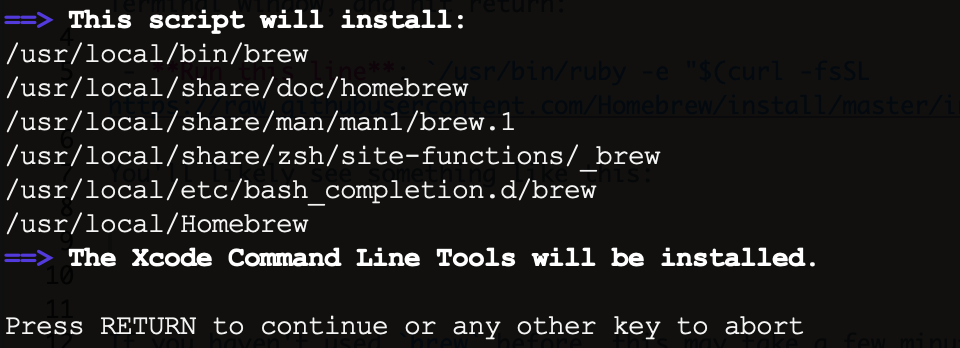

# Getting Spatialite and Spatialite_gui running on a MacOSX

Spatialite is a handy way to create/store spatial data inside a sqlite database. If none of those words make much sense, I recommend reading up a bit more on sqlite and spatialite before proceeding. The following instructions worked for me on macOS Mojave, v10.14 via a MacBook Pro from early 2015. If folks get this working on different/older versions, let me know.

## 1. Installing Homebrew

Getting spatialite on a mac isn't totally straightforward at this point, so the easiest option I found was via homebrew. Homebrew is a handy tool for many things, so it's worth grabbing and installing. The easiest option is via [homebrew](https://brew.sh/). So head over to the [hombrew webpage](https://brew.sh/), copy the long line of code at the top of the page and paste it into a Terminal window, and hit return:

 - **Run this line**: `/usr/bin/ruby -e "$(curl -fsSL https://raw.githubusercontent.com/Homebrew/install/master/install)"`

You'll likely see something like this:

Go ahead and hit return. If you haven't used `brew` before, this may take a few minutes to install...go grab a cup of coffee. One additional step that you may need to do is open XCode and accept the license after it's all done.

## 2. Getting `spatialite`

Next we want to install the "engine" that allows us to make/use spatial databases via SQLite. Again, we can use homebrew here. The nice thing is the code gets easier as we go forward. To install/update/upgrade packages in homebrew, we use `brew` with the command we want to do, then the package we're interested in. So, for spatialite:

 - `brew install spatialite-tools`
 
Again, you'll likely need to wait a few minutes. Once all the code is flying by and assuming you didn't have any errors, you can double check it installed with:

 - `brew info spatialite-tools`

Depending on your computer, you may need to install `gdal` as well, (`brew install gdal`).
 
## 3. Getting the `spatialite_gui`

One final step, that isn't necessarily required but may be helpful if you aren't interested in dealing with command-line and spatialite. There are number open source [spatial tools](https://www.gaia-gis.it/gaia-sins/) along with [QGIS](brew install saga-gis-lts) [(recent install instructions using homebrew here)](https://cran.r-project.org/web/packages/RQGIS/vignettes/install_guide.html), but one that might be particularly useful for spatialite and sqlite databases is something called [*spatialite-gui*](https://www.gaia-gis.it/gaia-sins/).

The easiest way to get it running on OSX is via Homebrew:

 - `brew install spatialite-gui`

## 4. How do we use it?

Having installed SpatiaLite, we can create/modify spatiallite databases, import shapefiles, all in a tidy SQLite database.

### Getting Some Data

Let's use a database used for a workshop taught by Michele Tobias. To download in the Terminal, we want to change directory (`cd`) to the place we'll want to save/work with our data (e.g, `cd ~Downloads`. Then use `wget`:

 - `wget https://github.com/MicheleTobias/Spatial_SQL/raw/master/sfbay.sqlite`

### Open spatialite-gui

To open the gui, in your Terminal, type `spatialite_gui`. This should open a new gui which allows you to create/interact with a spatialite database.

